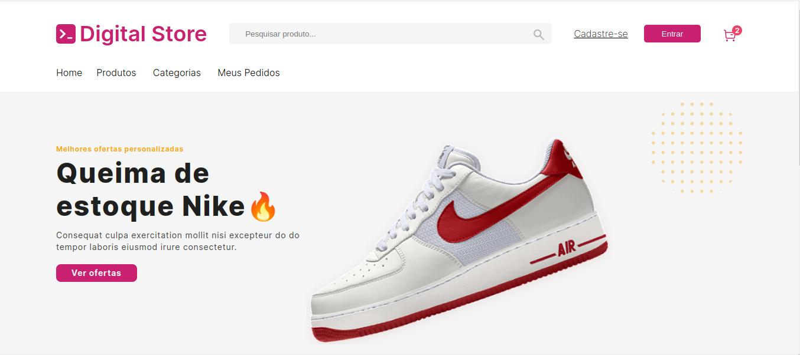

# Projeto Fullstack com ReactJS e Node.js

## Descrição
Este projeto é uma aplicação web fullstack que utiliza ReactJS no frontend e Node.js no backend. O objetivo do projeto é para fins de estudos e conclusão do curso fullstack na Digital College. O desenvolvimento de um ecommerce com e UI de fácil navegação e um gerenciamento de cadastro de clientes, com dados hospedados em um banco de dados MongoDB.

## Tecnologias Utilizadas
Frontend
ReactJS

### useRef: 
Utilizado para acessar diretamente elementos DOM e armazenar valores mutáveis.
### useEffect: 
Usado para lidar com efeitos colaterais, como chamadas à API e atualizações de DOM.
### useNavigate: 
Utilizado para navegação programática entre rotas.
### useState: 
Utilizado para gerenciamento de estado local em componentes funcionais.
### React Router DOM

Utilizado para gerenciar as rotas de navegação dentro da aplicação, permitindo a criação de uma SPA (Single Page Application) com múltiplas páginas e navegação dinâmica.
Backend
Node.js com Express

Express: Utilizado para criar a API RESTful que serve os dados para o frontend e lida com as requisições HTTP.
Axios

Utilizado no frontend para fazer chamadas à API, permitindo a comunicação entre o frontend e o backend.
Prisma

Utilizado como ORM (Object-Relational Mapping) para gerenciar e interagir com o banco de dados de forma eficiente e estruturada.
MongoDB

Utilizado para hospedar os dados de cadastro dos clientes, proporcionando um banco de dados NoSQL flexível e escalável.
Funcionalidades
Frontend
Interface de Cadastro e Listagem de Clientes: Permite aos usuários cadastrar novos clientes e visualizar uma lista de clientes cadastrados.
Navegação Dinâmica: Utilizando React Router DOM, a aplicação permite a navegação entre diferentes páginas, como a página de cadastro e a página de listagem de clientes.
Gerenciamento de Estado: Utiliza hooks do React para gerenciar o estado da aplicação e manipular dados de forma eficiente.
Backend
API RESTful: Desenvolvida com Express, fornece endpoints para criar, ler, atualizar e deletar dados de clientes.
Integração com Banco de Dados: Utiliza Prisma para interagir com o MongoDB, realizando operações de CRUD (Create, Read, Update, Delete) de forma eficiente.
Comunicação com o Frontend: Utiliza Axios para facilitar a comunicação entre o frontend e o backend, realizando chamadas à API para manipulação de dados.

Configure as variáveis de ambiente do backend:

Crie um arquivo .env na pasta backend e adicione suas variáveis de ambiente, incluindo a URL de conexão do MongoDB.
Inicie o servidor do backend:
Contribuições são bem-vindas! Sinta-se à vontade para abrir issues e pull requests.
